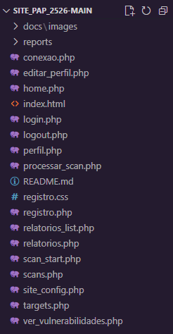

# 🎓 PAP - Automatização de testes de vulnerabilidades

## 👤 Informação do Aluno
**Nome:** Lucas Campinos Lopes de Oliveira  
**Número:** 9  
**Curso:** Profissional de Informática - Sistemas
**Ano Letivo:** 2025/2026 
**Orientador:** Patrícia Carvalhais

## 📋 Descrição do Projeto
Sistema de automação de testes de vulnerabilidades e geração de relatórios para sistemas web seguros.

## 🎯 Objetivos Principais
- [ ] Desenvolver um site dinâmico com base de dados
- [ ] Implementar sistema de autenticação de utilizadores
- [ ] Criar interface responsiva e intuitiva
- [ ] Implementar funcionalidade CRUD completa
- [ ] Fazer deploy da aplicação

## 🛠️ Stack Tecnológica

### **Frontend**
- [ ] HTML5, CSS3
- [ ] Bootstrap

### **Backend**
- [ ] PHP

### **Base de Dados**
- [ ] MySQL

### **Outras Ferramentas**
- [ ] Git & GitHub
- [ ] OWASP ZAP - API
- [ ] VSCode

## 📁 Estrutura do Projeto

## 📊 *Funcionalidades Implementadas*

### ✅ Concluídas
- Página inicial com listagem
- Sistema de registo e login
- Home page pós autenticação
- Perfil de utilizador
- Gestão de targets
- Scan de targets
- Geração de relatórios
- Configuração da página web

### 🔄 Em Desenvolvimento
- Correção de bugs

## 🗓️ Plano de Trabalho
Fase	Tarefas	Prazo	Estado
1	Planeamento e setup	01/09	✅
2	Desenvolvimento backend	01/10	🟡
3	Desenvolvimento frontend	01/10	🔴
4	Testes e deploy	30/11	🔴

## 📝 Relatório de Progresso
Última Atualização: 28/10/2025
O que foi feito desde a última atualização:
- Implementada a funcionalidade editar perfil do usuário
- Melhorado o design da página home.php

## Próximos passos:
- Otimizar performance do scan OWASP
- Correção de bugs do scan

## 🔗 Links Úteis
- Documentação OWASP - https://owasp.org/site-documentation/

## 📞 Contacto
- Email: a13889@agrcanelas.com
- GitHub: @lucaszaza

